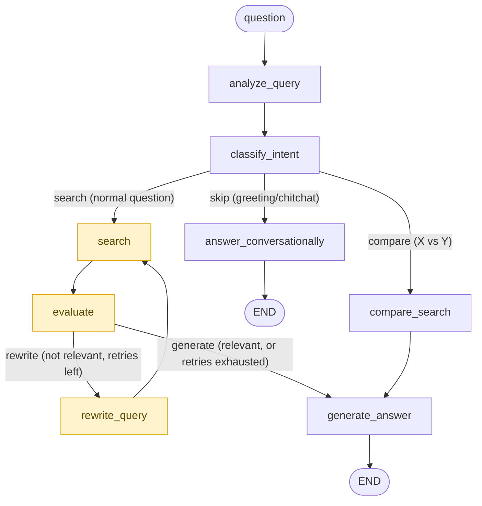

# Platform Overview

Technical deep-dive into the Permission-Aware SharePoint RAG Assistant: what
it is, how a request flows end to end, and — in detail — how the LangGraph
agent decides what to search for, when to retry, and when to answer.

This document consolidates and cross-references `README.md`,
`docs/ARCHITECTURE.md`, `docs/LANGGRAPH.md`, and `docs/SETUP.md`; those
remain the source of truth for setup steps and security-model rationale.
Everything below is verified directly against
`backend/services/langgraph_pipeline.py`.

## 1. What this platform is

An enterprise chat assistant that answers natural-language questions from
company SharePoint documents. Its core design guarantee: **a user can never
see, via the assistant, a document they couldn't already open directly in
SharePoint.** That boundary is enforced by Microsoft Graph itself (via a
per-user OAuth On-Behalf-Of token), not by application ACL logic and not by
prompting the LLM to behave — see [§7](#7-permission-enforcement-model).

## 2. Tech stack

| Layer | Technology |
|---|---|
| Frontend | React 18 + TypeScript, Vite, Tailwind v4, Radix UI, MSAL React |
| Backend | Python, FastAPI, Pydantic v2 |
| Authentication | Microsoft Entra ID (delegated tokens) |
| Delegated Graph access | OAuth 2.0 On-Behalf-Of flow (MSAL `ConfidentialClientApplication`) |
| Retrieval | Microsoft Graph Search API (`POST /search/query`), live per-request — no offline ingestion, chunking, or vector store |
| Generation | Azure OpenAI chat completions, incl. structured outputs (`response_format=<PydanticModel>`) |
| Agent orchestration | LangGraph 0.2.34 / langchain-core 0.3.9 (`StateGraph`) |
| Conversation persistence | SQLite, behind a `ConversationStore` abstraction (`backend/services/storage/`) |
| Deployment target | Azure Static Web Apps (frontend) + Azure App Service/Container Apps (backend) |

Notably absent: there is no document ingestion pipeline, no chunking step,
and no vector database anywhere in this system. `AzureOpenAIService.embed()`
(`backend/services/azure_openai.py:402`) exists but is never called by the
pipeline — retrieval is 100% live, delegated calls to Microsoft Graph's own
search/ranking, not a RAG-over-embeddings design.

## 3. Project layout

```
backend/
├── main.py                       FastAPI app: CORS, routers, exception handlers
├── core/config.py                Settings (env-var driven)
├── api/
│   ├── auth.py                   GET /api/auth/me
│   ├── chat.py                   V1 chat endpoint (RAGService, single-shot, unused by UI)
│   ├── chat_v2.py                V2 chat endpoint (LangGraphRAGService) — the one the frontend calls
│   ├── conversations.py          CRUD over persisted conversations
│   └── search.py                 Raw SharePoint search, no LLM (used to demo the permission model)
├── auth/
│   ├── entra.py                  Validates inbound Entra ID token -> UserContext
│   └── obo.py                    OAuth2 On-Behalf-Of exchange -> delegated Graph token, cached per user
├── services/
│   ├── graph.py                  GraphService: thin wrapper over Graph Search API
│   ├── sharepoint.py              SharePointService: OBO exchange + GraphService.search_sharepoint
│   ├── rag.py                    RAGService — V1 single-shot pipeline
│   ├── langgraph_pipeline.py      LangGraphRAGService — V2 agentic pipeline (this document's focus)
│   ├── azure_openai.py            AzureOpenAIService: every LLM call, prompts, structured-output models
│   ├── url_utils.py               SharePoint URL/folder-path helpers
│   └── storage/                  ConversationStore ABC + SQLite implementation
├── models/                       Pydantic models: auth, chat, documents, search
└── tests/                        incl. test_langgraph_pipeline.py, test_graph_*.py

frontend/src/
├── App.tsx, main.tsx              MSAL-gated app shell
├── authConfig.ts                  MSAL configuration
├── api/client.ts                  API client — CHAT_ENDPOINT hardcoded to /api/chat/v2
├── components/                    ChatWindow, MessageBubble, SourceCard/SourcesPanel,
│                                   ReasoningSteps.tsx / ChainOfThought.tsx (renders the agent's trace)
└── types.ts

docs/
├── ARCHITECTURE.md                Request-flow diagram, permission model, Pydantic model table
├── LANGGRAPH.md                   Detailed V2 graph write-up
└── SETUP.md                       Entra ID registration, OBO config, two-test-user walkthrough
```

## 4. Request lifecycle end to end

```
Browser (React + MSAL)
   │  1. sign in via Microsoft Entra ID -> Entra access token
   ▼
POST /api/chat/v2  (Authorization: Bearer <entra token>)
   │  2. backend/auth/entra.py validates the token -> UserContext
   ▼
backend/auth/obo.py
   │  3. OAuth2 On-Behalf-Of exchange (MSAL) -> delegated Graph token,
   │     scoped to THIS user, cached ~30s expiry buffer
   ▼
backend/api/chat_v2.py
   │  4. resolves/creates a persisted conversation, loads history (SQLite)
   │  5. hands off to LangGraphRAGService (see §5)
   ▼
LangGraph agent
   │  6. classify intent -> search/rewrite/retry -> evaluate -> generate
   ▼
ChatResponse { answer, citations, retrieval_attempts, reasoning_steps }
   │  7. streamed variant emits NDJSON: {"type": "conversation"|"step"|"token"|"done"|"error"}
   ▼
Browser renders answer + citations + a collapsible "chain of thought" of reasoning_steps
```

The frontend only ever holds its own Entra ID token — it never sees a Graph
token or an Azure OpenAI key.

## 5. The agent: LangGraph pipeline

This is the "agent" referenced throughout: a `StateGraph` (LangGraph) that
orchestrates multi-step, self-correcting retrieval before generation, built
in `backend/services/langgraph_pipeline.py`, class `LangGraphRAGService`. It
is the only pipeline the frontend calls (`POST /api/chat/v2` /
`/api/chat/v2/stream`, via `backend/api/chat_v2.py`). A simpler single-shot
V1 (`RAGService` in `backend/services/rag.py`) still exists but is unused by
the UI — it runs one search and answers from whatever comes back, with no
retry or relevance check.

### 5.1 State schema — `RAGState(TypedDict)`

| Field | Purpose |
|---|---|
| `question`, `user`, `conversation_history` | The raw inputs: the message, the authenticated caller, and prior turns (capped, threaded only into final-answer generation, not into retrieval decisions) |
| `search_query` | The query currently being searched — starts as the raw question, mutated by `rewrite_query` |
| `needs_retrieval` | Set by `classify_intent`: does this message need a SharePoint search at all? |
| `documents`, `prompt_context` | Results and assembled context from the *most recent* search attempt |
| `is_relevant` | LLM verdict on whether `prompt_context` actually answers the question |
| `retrieval_attempts`, `max_retries` (`=8`) | Retry bookkeeping for the search/evaluate/rewrite loop |
| `previous_queries` | Every query already tried this request, in order — fed back into the rewrite prompt so retries don't repeat similar phrasings blind |
| `best_documents`, `best_context` | The richest non-empty result seen across *any* attempt, not just the latest — hedges against a false-negative relevance verdict silently discarding a real find |
| `answer`, `citations` | The final generated answer and its sources |
| `reasoning_steps` | Execution trace appended to by every node, rendered in the frontend's "chain of thought" panel |
| `generation_mode`, `generation_context` | What to generate ("answer" / "clarification" / "conversational") and with what context — set once by `_decide_generation` so the streaming graph can stop right before generation |
| `is_comparison`, `entities` | Set by `analyze_query`: whether this is a "compare X vs Y" question, and the extracted entities |
| `entity_documents`, `entity_found` | Per-entity results from the comparison path, kept separate from the merged `documents` list |
| `citation_documents` | The raw document list `citations` were derived from, so citations can later be narrowed to what the answer actually used |

### 5.2 Graph construction

```python
graph = StateGraph(RAGState)

graph.add_node("analyze_query", self._analyze_query)
graph.add_node("classify_intent", self._classify_intent)
graph.add_node("search", self._search)
graph.add_node("evaluate", self._evaluate)
graph.add_node("rewrite_query", self._rewrite_query)
graph.add_node("compare_search", self._compare_search)
graph.add_node("answer_conversationally", self._answer_conversationally)  # or _prepare_conversational when streaming
graph.add_node("generate_answer", self._generate_answer)                  # or _prepare_generation when streaming

graph.set_entry_point("analyze_query")
graph.add_edge("analyze_query", "classify_intent")
graph.add_conditional_edges(
    "classify_intent", self._route_after_classify,
    {"search": "search", "compare": "compare_search", "skip": "answer_conversationally"},
)
graph.add_edge("search", "evaluate")
graph.add_conditional_edges(
    "evaluate", self._route_after_evaluate,
    {"generate": "generate_answer", "rewrite": "rewrite_query"},
)
graph.add_edge("rewrite_query", "search")
graph.add_edge("compare_search", "generate_answer")
graph.add_edge("generate_answer", END)
graph.add_edge("answer_conversationally", END)

return graph.compile()
```
*(`langgraph_pipeline.py:204-238`)*

Two compiled graphs are built in `__init__`: `self.graph` (full,
non-streaming) and `self.graph_stream` — identical routing, but its
terminal nodes (`_prepare_conversational`, `_prepare_generation`) stop right
before the actual LLM generation call, so `stream_answer()` can stream
tokens outside the graph instead of awaiting a full response inside a node.

### 5.3 Graph topology diagram



The highlighted `search -> evaluate -> rewrite_query` cycle is the retry
loop, bounded by `MAX_RETRIES = 8` (`langgraph_pipeline.py:58`). LangGraph's
own recursion guard is explicitly sized to exceed the worst-case step count
of that loop: `_RECURSION_LIMIT = MAX_RETRIES * 3 + 10` (line 66) — the
default of 25 would otherwise trip for unrelated reasons before the retry
budget is exhausted.

### 5.4 Node-by-node walkthrough

- **`analyze_query`** (`:246-269`) — normalizes the question into
  `search_query`. Runs a cheap string pre-filter (`_looks_like_comparison`,
  `:116-118`, matching on words like "compare", "vs", "difference between")
  before paying for a real LLM call (`llm.classify_entities`,
  structured-output model `EntityExtraction { is_comparison, entities }`) —
  so a comparison classifier only runs on questions that already look like
  they might need it.
- **`classify_intent`** (`:271-290`) — real Azure OpenAI structured-output
  call (`llm.classify_needs_retrieval` → `IntentClassification { needs_retrieval: bool }`,
  `temperature=0`) deciding whether this message needs a document search at
  all. Exists because Graph's Search API returns *some* document for almost
  any query string by design — without this gate, "hi" would come back with
  citations unrelated to anything asked. Falls back to a hardcoded
  `_CHITCHAT_MESSAGES` exact-match set only if the LLM call itself fails.
- **`_route_after_classify`** (`:292-300`) — conditional edge →
  `"skip"` / `"compare"` / `"search"`.
- **`answer_conversationally`** (`:302-323`) — skip-search path. Calls
  `llm.generate_conversational_reply` for a genuine LLM reply (not a
  hardcoded string), falls back to `_FALLBACK_CHITCHAT_REPLY` on failure. No
  Graph/SharePoint call happens on this path.
- **`search`** (`:325-351`) — the retrieval step: calls
  `SharePointService.search(user, query, max_results)`, appends the query to
  `previous_queries`, increments `retrieval_attempts`, records a reasoning
  step (`Searching for "<query>"` / doc count found).
- **`evaluate`** (`:353-395`) — builds context from the returned documents,
  then a real LLM judgment call `llm.evaluate_relevance(question, context)`
  (structured-output `RelevanceEvaluation { is_relevant: bool }`,
  `temperature=0`) — not just a "did we get any documents back" presence
  check. This catches the case where Graph finds the *right* document but
  hands back a snippet that doesn't contain the specific fact asked for.
  Also updates `best_documents`/`best_context` whenever this attempt's
  context is the richest one seen so far.
- **`_route_after_evaluate`** (`:397-411`) — conditional edge →
  `"generate"` if relevant or retries exhausted, else `"rewrite"`.
- **`rewrite_query`** (`:413-416`, `_llm_rewrite_query` at `:645-701`) — asks
  the LLM for a new search query, explicitly told every previously-tried
  query so it doesn't repeat similar phrasings. The prompt spells out a
  staged strategy: (1) check for a spelling mistake in a proper noun first
  and OR multiple spelling variants together — Graph's Search API does
  exact-ish keyword matching, so a single misspelled place/document name is
  enough to return zero results even when the real document exists; (2) if
  that's already been tried, drop the most specific/unusual word entirely;
  (3) only then, fall back to a broader phrasing or synonym.
- **`compare_search`** (`:418-510`) — handles "compare X vs Y" questions.
  Runs an independent, bounded search/evaluate/rewrite loop per entity
  (capped by `Settings.MAX_RETRIES_PER_ENTITY`), tracks a per-entity
  `best_docs` hedge the same way `evaluate` does at the whole-question
  level, merges/dedupes results (`_merge_and_dedupe`, `:512-522`), and
  builds a per-entity-labeled context including an explicit "no documents
  found for X" note for a missing entity (`_build_comparison_context`,
  `:524-544`).
- **`_decide_generation`** (`:546-597`) — pure decision logic (no LLM call)
  shared by streaming and non-streaming paths: picks `generation_mode` —
  `"clarification"` if nothing was ever found (`best_context` empty),
  otherwise `"answer"` reusing either the last attempt's documents/context
  (if relevant) or the `best_documents`/`best_context` hedge (if the last
  attempt was marked irrelevant but something was found earlier).
- **`generate_answer`** (`:602-641`) — terminal node. Calls
  `_decide_generation`, then one of `llm.generate_clarification`,
  `llm.generate_comparison_answer`, or `llm.generate_answer` depending on
  mode, then narrows citations via `_filter_citations_to_used` (`:714-740`)
  — an LLM call (`select_used_citations` → `CitationSelection`) that keeps
  only documents the composed answer actually drew from, so search
  returning several plausible candidates doesn't over-cite.

### 5.5 Streaming variant

`stream_answer()` (`:789-903`) runs `self.graph_stream` (same routing, node
functions that stop just before generation) via `astream(...,
stream_mode="values")`, emitting `{"type": "step", ...}` for each new
reasoning step as it appears. Once the graph finishes, it streams the actual
answer token-by-token outside the graph
(`llm.generate_answer_stream`/`generate_comparison_answer_stream`/
`generate_conversational_reply_stream`/`generate_clarification_stream`),
emitting `{"type": "token", "text": ...}` per delta, and finishes with
`{"type": "done", "answer", "citations", "retrieval_attempts"}`.

### 5.6 "Tools" the agent calls

There is no OpenAI-function-calling-style tool binding — the agent doesn't
let the LLM choose which tool to invoke. Instead, each graph node
deterministically calls one of two things:

1. **SharePoint/Graph search** — `SharePointService.search()` →
   `GraphService.search_sharepoint()` → Microsoft Graph
   `POST /search/query`, gated by the OBO-derived per-user token.
2. **An Azure OpenAI call**, each with its own system prompt
   (`backend/services/azure_openai.py`), several using Pydantic structured
   outputs (`client.beta.chat.completions.parse(..., response_format=<Model>)`):

   | Call | Structured output | Used by |
   |---|---|---|
   | `classify_needs_retrieval` | `IntentClassification` | `classify_intent` |
   | `classify_entities` | `EntityExtraction` | `analyze_query` |
   | `evaluate_relevance` | `RelevanceEvaluation` | `evaluate`, `compare_search` |
   | `select_used_citations` | `CitationSelection` | `_filter_citations_to_used` |
   | `generate_answer` / `_stream` | free text | `generate_answer` (grounded, normal) |
   | `generate_comparison_answer` / `_stream` | free text | `generate_answer` (comparison) |
   | `generate_conversational_reply` / `_stream` | free text | `answer_conversationally` |
   | `generate_clarification` / `_stream` | free text | `generate_answer` (nothing found) |
   | `embed` | — | not called anywhere in the pipeline |

## 6. Retrieval pipeline detail

There is no offline ingestion, chunking, or vector database. Retrieval is
entirely live, per request:

1. `SharePointService.search(user, query, max_results)`
   (`backend/services/sharepoint.py`) obtains a delegated Graph token via
   OBO exchange (`backend/auth/obo.py`, cached per-user with a 30s expiry
   buffer).
2. `GraphService.search_sharepoint()` (`backend/services/graph.py:77-168`)
   POSTs to `https://graph.microsoft.com/v1.0/search/query` with
   `entityTypes: ["driveItem"]`. The query is the question passed through
   almost verbatim — only whitespace-trimmed (`_build_kql_query`,
   `graph.py:24-37`); an earlier version tried stripping stopwords and
   OR-ing keywords, but that discarded phrase/proximity signal Graph's own
   ranking already uses well, and was reverted. Results are parsed from
   `hitsContainers[].hits[]` into `SourceDocument` objects (id, name,
   web_url, site/drive info, `relevant_content` = Graph's own snippet,
   folder path).
3. Context assembly — `_build_context` / `_build_comparison_context` in
   `langgraph_pipeline.py` concatenate `[document_name]\nrelevant_content`
   blocks up to `Settings.MAX_RAG_CONTEXT_CHARS` (default 12000 chars).
4. Generation — Azure OpenAI chat completion with `SYSTEM_PROMPT`
   instructing the model to answer only from the supplied excerpts, never
   invent facts, and never reference documents not listed.

## 7. Permission enforcement model

The set of documents that can ever influence an answer is fixed the moment
`SharePointService.search()` returns — that call is made with a Graph token
obtained via OBO **for the specific requesting user**. Microsoft Graph, not
application code, decides what's visible; results the user can't see in
SharePoint are simply absent from the response, never filtered out
downstream. `prompt_context` is built exclusively from that returned
document list, and citations are derived 1:1 from the same list — a
document can never be cited unless it was also part of the LLM's context.

Query rewriting and retries (§5.4) never touch this boundary: they change
*what* is searched for, never *who* the search runs as. Even if the LLM
"knows" something from training data, the system prompt instructs it to
answer only from supplied context — but the security guarantee itself does
not depend on the model following that instruction, since unauthorized text
is never placed in the prompt to begin with.

## 8. API surface

| Endpoint | Purpose |
|---|---|
| `POST /api/chat/v2` | LangGraph pipeline, non-streaming — the endpoint the frontend calls |
| `POST /api/chat/v2/stream` | Same pipeline, NDJSON streaming (`conversation`/`step`/`token`/`done`/`error` events) |
| `POST /api/chat` | V1 single-shot `RAGService` — unused by the UI, kept for comparison |
| `GET /api/search` | Raw SharePoint search, no LLM — demonstrates that two users get different results for the same query |
| `GET /api/auth/me` | Returns the authenticated `UserContext` |
| `/api/conversations/*` | CRUD over persisted conversations (SQLite) |

## 9. Comparison-question path

A "compare X vs Y" question is routed by `classify_intent` →
`_route_after_classify` to `compare_search` instead of the normal single
search/evaluate/rewrite loop, because a single blended Graph query for two
unrelated entities often can't surface both in one top-K result set. Each
extracted entity gets its own bounded search+evaluate+rewrite loop (capped
per entity), and results are merged into one document list for citations
while the generation context stays labeled per entity — including an
explicit "no documents found for X" note when one entity's search comes up
empty. See §5.4's `compare_search` entry for the node-level detail.

## Further reading

- [`README.md`](README.md) — top-level project summary and setup quickstart
- [`docs/ARCHITECTURE.md`](docs/ARCHITECTURE.md) — request-flow diagram, Pydantic model table
- [`docs/LANGGRAPH.md`](docs/LANGGRAPH.md) — original graph write-up with requirement-to-implementation mapping and test references
- [`docs/SETUP.md`](docs/SETUP.md) — Entra ID app registration, OBO configuration, two-test-user permission walkthrough
